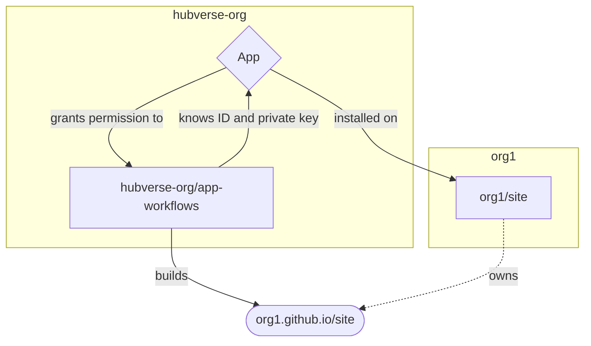
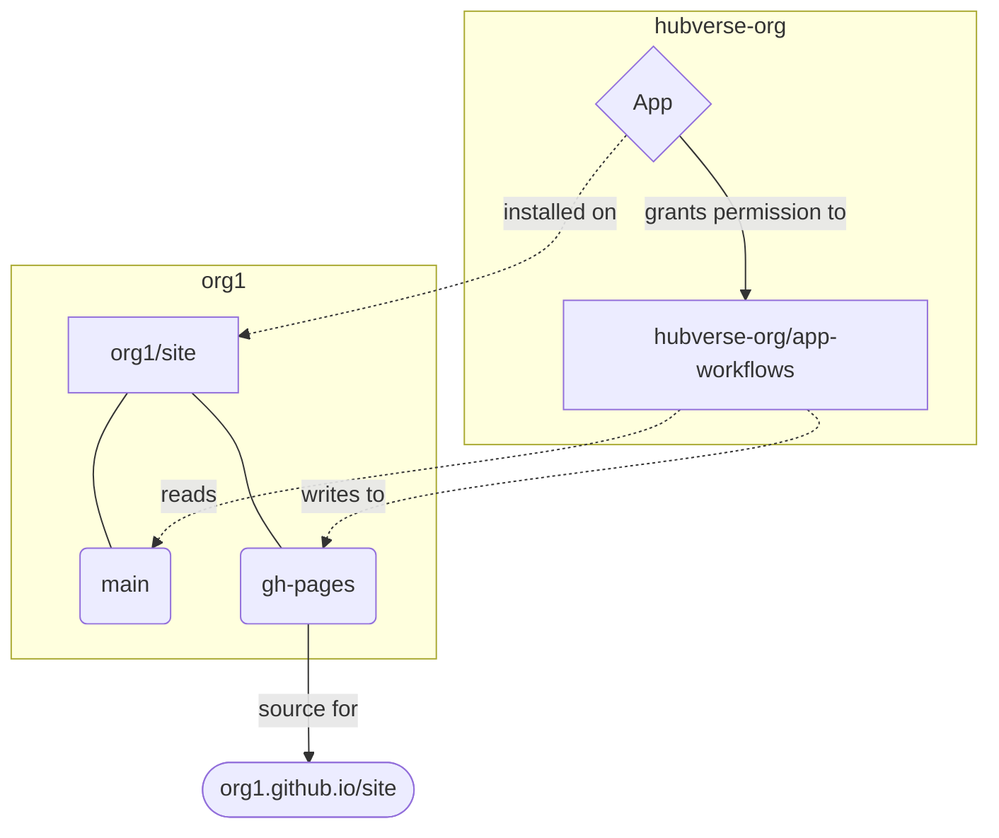
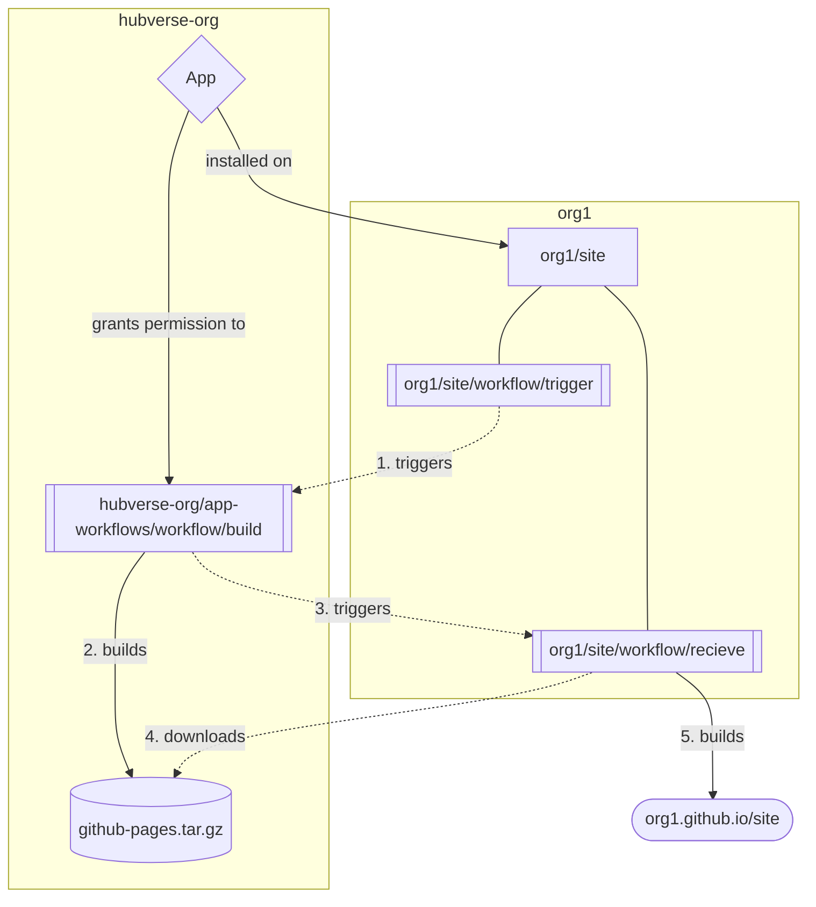

## GitHub App Testing

This is testing how a GitHub App works.

Goal: provide a service that will build a templated GitHub pages site for
repositories that have this app installed without requiring the admin for the
site to maintain a GitHub Workflow and without requiring hosting on an external
service like AWS.

Problem: We want to allow people to put markdown files in a folder and get a
website for their hubverse hub that contains predtimechart and evaluations
without needing to store templated data or navigate complex directories required
by static site generators. A setup like this normally requires github workflows
to live in the repository, like [The Carpentries
Workbench](https://carpentries.github.io/workbench). The problem with this
approach: it becomes difficult to update these workflows when something needs to
change. 

## Proof of concept

Much of the prior art comes from how the r-universe works in that it does not
require users to set up GitHub actions to run everything:
https://github.com/r-universe-org/control-room/

Effectively, we want to have a situation like this:

The problem is that it is not possible to _directly_ build a gh-pages site. The
only way we could maintain a workflow this simple is if we deployed to a site
owned by this repo (e.g. an AWS S3 bucket or Netlify), but that means extra
maintenance work for us and lack of customisable domains for the users (without
significant effort). Below are two potential solutions.

### Solution 1: No workflow in repo, but App writes to `gh-pages`

 - Pros
   - no extra workflow needed for user repo
 - Cons
   - App has write permissions for _all non-workflow content_ in the user's repo
   - Admins may not be able to manually trigger workflows (though that may be
     possible with an issue or PR comment)
   - Admins must wait until the first build is successful to turn on gh-pages
     (because the `gh-pages` branch must be created first)

#### Solution 1 Process

I was able to set up a proof of concept GitHub app (it's private and called
"macrohard-onfire-goggles") on my account. It shows that we can centralize the
build process without requiring hub maintainers to add yet another GitHub
Workflow. This also has implications for the workflows to validate hubs as we
can potentially centralize those as well.

I installed this app on two repositories (one public, one private) and use it
to automatically update their `gh-pages` branch without having GitHub Actions
enabled on those repositories. The public repo is
https://github.com/zkamvar/CardTrick and the generated github page is
https://zkamvar.github.io/CardTrick/

To do this, I created a separate test repository where I added the App ID and
private key and then created a workflow that would generate a token, fetch the
repositories that had the app installed, generated the pages, and force-pushed
them to gh-pages:
https://github.com/zkamvar/test-fictional-octo-disco/blob/main/.github/workflows/outside-pages.yml

The push does not have to be a force-push, I just implemented a workflow that
used force pushing because I had it available. 

### Solution 2: Workflow in repo that triggers the build from App and then deploys

 - Pros
   - App does not have write permissions to the repositories, so no risk of data
     manipulation
 - Cons
   - Repositories must maintain at least one workflow file to receive a signal
     from the app, download and deploy the artifact. 

